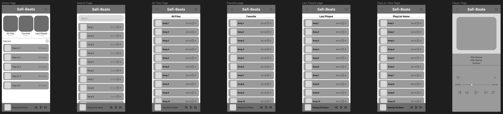

# beats

  

`search all audio files in android phone to be able to play it`

this project is a clone of samsung music app that i use a lot
and now i use another android phone not samsung and i can not use samsung music so I am building it myself from scratch

---

Todo:

1. [x] read all audio files on your device(android)
2. [x] play, pause, replay, play next, and play previous
3. [ ] search for audio files
4. [ ] fix permissions issues
5. [x] auto play audio after the playing audio end
6. [x] randomize the playback
7. [ ] create playlist and add audio files to the playlist
8. [ ] finish working on the wireframe and the design (40%)

---

[Figma Design WireFrame](https://www.figma.com/file/G2VxommQkOg88BJkbdMmnn/Safi-Beats?type=design&node-id=0-1&mode=design)

---

This project is a Prototype
I am working on new UI and List of features to create a new Music player
now when you run the project first time the project will crash but give permissions page will appear accept persmissions the run the program again it will work normally  

---

| Home                                                                            | player                                                                          |
| ------------------------------------------------------------------------------- | ------------------------------------------------------------------------------- |
|  |  |
